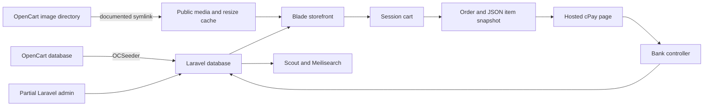

# Simple Shop application analysis

This existing Laravel store should be modernized incrementally. The storefront and guest payment flow provide a useful foundation; administration is incomplete and OpenCart remains a content and media dependency. A framework upgrade alone will not resolve the authorization, payment-state, and data-integrity findings below.

Reviewed October 6, 2026, America/Phoenix, against `develop` at `93d6e04d9efb3a905097c1973edad74813549e34`. The working tree was initially clean. Local `origin/develop` points to the same commit; the remote was not refreshed. No local tags existed. Production functionality is reported by the owner; deployed source, runtime, and database parity remain unverified.

## Architecture and source map

The application is a server-rendered Laravel monolith with Blade, Bootstrap 5, Axios, jQuery, and Vite. Public browsing largely uses route closures; cart, checkout, callbacks, contact, and administration use controllers. A separate frontend application is unnecessary for the stated requirements.

This maps code and documented dependencies, not a verified live deployment.

- `routes/web.php`: browsing/search, cart/order/contact resources, public import trigger, resizing, and bank callbacks.
- `routes/admin.php`, `routes/auth.php`: management resources and Breeze authentication under `/admin`.
- `app/Http/Controllers/Admin`: product editing/deletion and order listing.
- `app/Http/Controllers/MediaController.php`: filesystem image listing; other resource actions are empty.
- `app/Models`, `database/migrations`: catalog, media, page, order, identity, and infrastructure records.
- `database/seeders/OCSeeder.php`: content import, admin overwrite, path rewriting, and sitemap generation.
- `app/Classes/CaSys.php`, `BankController.php`, `resources/views/order/confirm.blade.php`: outbound signing, payment form, and callbacks.
- `app/Helpers/Image.php`, resize route, `public/cached-media`: image URLs and synchronous conversions.
- `config/filesystems.php`, `config/backup.php`, `app/Console/Kernel.php`: storage and scheduled backups.

## Current functionality

### Storefront and content

Home/category pages show products with quantity greater than zero. Products have a name, slug, model code, HTML description, primary image path, price, discount, tax reference, quantity, and active flag. Products can belong to multiple categories and have multiple additional media records.

Product pages show related media, falling back to the primary image only when no related media exists. The primary image is therefore not automatically part of a populated gallery. Descriptions and page bodies are decoded and rendered as raw HTML. Pages use `/pages/{slug}`. Content and configured locale are Macedonian; payment currency is MKD.

Search uses Scout/Meilisearch and transliterates indexed names/descriptions with `Str::ascii`. Search does not apply the stock filter used on home/category pages. The active flag is not consistently enforced. Product/page lookups may return null rather than a deliberate 404. Lists are unpaginated. `SharedVariables` loads every category and page on every web request, including callbacks and image requests handled by Laravel.

### Cart and guest checkout

`CartController` uses `darryldecode/cart` with an identifier stored in the Laravel session. Adding a product reads its database price and forces quantity to one; quantity updating is empty. Any nonzero discount applies a fixed 15% cart reduction, while the storefront uses the actual percentage, so displayed and charged prices can differ.

Cart storage is session-based, with a configured default lifetime of 120 minutes. No independent visitor-cart store, customer-cart relationship, or login merge policy exists. A guest cart can survive within the session lifetime, but durable retention is absent.

`OrderController::store` saves customer details, cart items as JSON, and the cart total without requiring an account. It reuses a session order ID and updates the record only if the total changes. Correcting an address or replacing items with equally priced products leaves stale order data. No final stock/price revalidation or empty-cart rejection exists in that POST action. Cart display also dereferences products without handling deletion.

### Payment and orders

1. Order confirmation posts to the hosted cPay payment page.
2. `CaSys::get` builds provider fields, converts total to minor units through float multiplication/integer casting, and computes an uppercase MD5 checksum with a source-embedded secret.
3. `POST /bank/ok` finds an order using `Details2`, writes `cPayPaymentRef`, sets finished, and subtracts one from each product's stock.
4. `POST /bank/fail` rebuilds cart entries from the saved order.

No inbound signature, amount/currency, or provider-status verification is visible in these callbacks. Outbound signing does not authenticate inbound results. There is no transaction, row lock, stock reservation, or duplicate-callback guard. Repeated success processing can repeatedly reduce stock. Missing orders/malformed items are not handled defensively, and failure handling uses an unverified order identifier.

No successful-payment cart/order-session cleanup was found, so a completed order can remain the session's checkout order. Administration labels every unfinished order “Failed”, conflating pending, abandoned, and failed payments. No order confirmation email, refund workflow, shipping workflow, or reconciliation job was found. These are repository observations, not evidence of failed live payments. The provider's actual merchant protocol must guide changes; do not replace its checksum algorithm based on assumptions.

### Administration

- Product listing, editing of six basic fields, and deletion exist. Creation is empty, and the list hides zero-stock products, making restocking difficult.
- TinyMCE already edits product descriptions through Tiny Cloud. npm also contains TinyMCE 6.8.0, but its application imports are commented out.
- An image-picker modal fetches previews but does not persist a selection or connect to TinyMCE insertion/product relationships.
- Page/category controllers are placeholders. Many generated Form Requests reject authorization and provide no validation rules.
- Media listing scans only the top directory of `public/media/images` and returns arrays. Its normal Blade view expects file objects, so those interfaces disagree. Upload, editing, deletion, ordering, nested browsing, and video workflows are absent.
- Order administration is a list; profile/password handling comes from Breeze scaffolding.

### Authentication and authorization

Public `/admin/register` creates and authenticates a user. Management routes require `auth` and `verified`, but no admin role exists and User does not implement `MustVerifyEmail`. `ProductPolicy` permits every action for any user, and product actions do not explicitly enforce that policy. Authentication therefore does not establish a staff boundary. A self-registered user can reach management actions at the application layer; any extra live web-server restriction is unverified.

Logout is a GET route. The `/admin` redirect references a `dashboard` route name absent from the inspected routes; overlapping admin resource routing needs a route-map test. Existing authentication/profile tests target paths such as `/login` and `/profile`, while the application places them under `/admin`.

## Migration-defined data model

A later database copy must establish actual schema, indexes, engine, collation, row counts, and drift.

- `products`: unique slug, required model/image, double price/discount, integer tax ID/quantity, active flag, timestamps/deleted-at.
- `categories`: name/slug, with no unique slug constraint or hierarchy.
- `category_product`: IDs/timestamps, without foreign keys, pair uniqueness, or explicit indexes.
- `media`: name, 1,024-character path, filename, optional width/height strings, image/video type. No disk, MIME, size, checksum, alt text, or usage inventory.
- `media_product`: IDs/timestamps without ordering, cover flag, foreign keys, or pair uniqueness.
- `pages`: title, unique slug, body, timestamps/deleted-at; no publishing state, preview token, or revision history.
- `orders`: customer/address details, JSON items, float total, finished boolean, optional bank reference. No customer link, line-item table, currency, payment attempts, or unique provider reference.
- `taxes`: name/double value. Import sets product tax ID to 1; checkout does not visibly calculate tax from this table.
- `catalogs`: ID/timestamps/deleted-at only, without an established business role.
- `users`: standard identity/password/verification/remember token; no role or social identities.
- Infrastructure: sessions, jobs, failed jobs, password reset tokens, and Sanctum tokens.

Business tables have deleted-at columns but their models do not use `SoftDeletes`. Product deletion is physical and relationship cleanup is not database-enforced. Enabling soft deletes later requires inspecting existing deleted-at data and agreeing intended visibility.

## OpenCart import and media dependency

The `oc` connection uses `DB_OC_*`, but also shares `DATABASE_URL`; isolate that URL explicitly in migration/test environments. `OCSeeder` reads `product`, `product_description`, `category`, `category_description`, `product_image`, `product_to_category`, and `information_description`.

The importer reuses source primary keys, generates slugs from names, copies gallery/category relationships, resets discounts to zero and tax ID to one, globally rewrites `catalog/` paths to `images/`, overwrites user ID 1 with a fixed identity/password, and generates a sitemap.

- Reimport can overwrite native edits, sold stock, discounts, and admin credentials.
- Removed source records/relationships are not reconciled; existing stale links remain.
- Description joins do not filter language/store. Multiple languages, duplicate slugs, and table prefixes require handling.
- No dry run, run manifest, checkpoint, conflict policy, or transaction across the import is defined.
- Primary images and HTML-embedded media need inventory separately from gallery records.
- The documented symlink points into OpenCart's image directory. SQL import does not copy files. `public/media/images` is missing locally.

`DatabaseSeeder` truncates users, creates samples, and calls `OCSeeder`; it is unsafe as routine setup for an existing database. A surrounding `opencart.sql` file exists, but contents/freshness were not inspected and it was not imported. It is not the agreed later live-data copy.

## Image processing

`Image::get` generates `/media-resize/{path}?w=...&h=...&q=...`. The route concatenates the path under `public/media`, transforms through Intervention Image 2, and writes mirrored WebP derivatives under `cached-media`. Requested quality affects cache naming, but output is always saved at quality 50.

No explicit canonical path/root validation or dimension/file-size limits exist at this boundary. Extension parsing assumes a simple filename, source changes do not invalidate derivatives, and errors redirect to the original media URL with unreachable fallback code after the redirect. Constrain file resolution and transformation work, define cache invalidation, and handle missing files. Exploitability through the live server was not tested.

## Dependency and runtime inventory

Locked versions, with installed direct Composer versions matching the lockfile:

- Laravel 10.31.0; Sanctum 3.3.2; Breeze 1.26.1; Scout 10.5.1; Tinker 2.8.2.
- Cart 4.2.4; Intervention Image 2.7.2; Laravel Share 4.2.0; Meilisearch PHP 1.4.1.
- Spatie Backup 8.8.2; Sitemap 7.0.0; Google Drive Flysystem adapter 2.4.1.
- Guzzle 7.8.0; HTTP factory 1.2.0; Doctrine DBAL 3.7.1.
- PHPUnit 10.4.2; Collision 7.10.0; IDE Helper 2.13.0; Ignition 2.3.1; Pint 1.13.6; Sail 1.26.0; Faker 1.23.0; Mockery 1.6.6.
- Vite 4.5.0; Laravel Vite plugin 0.8.1; Bootstrap 5.3.2; Axios 1.6.2; TinyMCE 6.8.0; Sass/icons in the npm lockfile.

Numerous locked packages constrain Illuminate to Laravel 10/11. Updating only the framework requirement cannot resolve the upgrade. The cart root requirement is an unbounded `*`.

Local tools: PHP 8.4.22, Composer 2.7.7, Node 18.17.1, npm 10.9.8. These are not verified live versions. Surrounding Docker files use Ubuntu 22.04, distro PHP, a PHP 8.1 Xdebug path, MariaDB `lts-jammy`, Apache, and Meilisearch 1.4. They sit outside this application's Git root and need their own versioning/update plan.

Laravel 10 security support ended February 4, 2025; Laravel 11 ended March 12, 2026. Laravel 12 receives security fixes until February 24, 2027. Laravel 13 requires PHP 8.3+ and receives security fixes until March 17, 2028. Target 13, with 12 only as a temporary fallback. [Laravel support policy](https://laravel.com/framework/docs/13.x/releases)

Intervention Image 2 and Node 18 are end-of-life. Evaluate the maintained image API; use Node 24 LTS as the proposed build runtime. [Intervention Image](https://image.intervention.io/v2), [Node releases](https://nodejs.org/en/about/previous-releases)

## Operations and backups

The scheduler declares backup cleanup at 00:00 and creation at 06:00 daily; app timezone is UTC. Backup source includes the app and an explicit OpenCart image directory, excludes all `storage`, and does not follow symlinks. It backs up Laravel's `mysql` connection, not the OpenCart database, and writes locally and to Google Drive. The monitor name differs from the backup name and covers only local disk. Scheduler execution, cloud access, notifications, retention, and restore success remain unverified.

The `public` disk covers the whole public directory. Moving media into `storage/app` without changing backup exclusions would omit new originals. The Google Drive driver needs compatibility and restore tests. The nearby Supervisor configuration is entirely commented out; active workers/scheduler wiring are not established by these files. No tracked CI workflow was found. The parent repair script clears queues/caches and is inappropriate for routine diagnosis.

## Prioritized findings

Priorities express potential impact from code evidence, not confirmed exploitation.

### Critical production review

- **F01 Public import and credential overwrite:** `routes/web.php:85` invokes `OCSeeder --force` without authentication. The seeder rewrites content/stock and user ID 1 (`OCSeeder.php:36`). Remove the HTTP trigger and replace repeat imports with a controlled operation.
- **F02 Unverified payment completion:** `BankController::ok/fail` trusts order fields without visible provider verification. Success changes paid state/stock; callbacks can expose/use order details. Obtain the provider contract and authenticate results.
- **F03 Missing administrator boundary:** public registration plus no role enforcement permits management access at the application layer. Evidence: auth/admin routes, User, registration controller, UpdateProductRequest, ProductPolicy.
- **F04 Embedded credentials and diagnostics:** payment/admin credentials exist in source, and tracked `public/a87c81.php` runs `phpinfo()`. Remove diagnostics, configure secrets, and coordinate rotation of real/reused credentials. Removing a value from a new commit does not erase history.

### High integrity and upgrade risk

- **F05 Payment/stock consistency:** duplicate success callbacks reduce stock repeatedly; no atomic transaction or concurrency protection exists.
- **F06 Stale checkout/pricing:** order reuse depends only on changed totals, completed orders remain reusable, and any discount becomes 15% in the cart.
- **F07 Unsafe test defaults:** feature tests use `RefreshDatabase` while database overrides are commented out; seeders are destructive.
- **F08 HTML/media boundaries:** server-side sanitization and bounded image path/size processing are absent.
- **F09 Unsupported dependencies:** framework and package upgrades are necessary. Package age alone is not a specific vulnerability finding.
- **F10 Cutover/restore gaps:** database import does not make media independent; backups require adjustment for new storage and proof of restoration.

### Functional and maintenance gaps

- **F11 Native authoring:** product creation, pages/categories, uploads, selection persistence, video, and media ordering/deletion are incomplete.
- **F12 Schema consistency:** floating money, unconstrained pivots, limited order/payment structure, and inactive soft deletes need data-aware migrations.
- **F13 Storefront behavior:** pagination, visibility, missing-record handling, gallery cover behavior, and repeated shared queries need focused changes.
- **F14 Ancillary behavior:** contact POST lacks server validation/rate limiting; sitemap image filtering assigns instead of compares the type; auth tests use old paths; backup monitoring/worker operation need verification.

## Verification and limits

- PHP syntax passed for 149 source/configuration/migration/test files, excluding bootstrap cache.
- Composer validation passed with a wildcard-cart warning and old-tool deprecations under PHP 8.4.
- The non-application unit example passed: one test, one assertion. It provides no store regression coverage.
- Vite build passed in a temporary copy without `.env` and without modifying the app's public build assets.
- Composer/npm advisory checks could not reach registries. There is no verified advisory count or clean audit result.
- Feature tests, HTTP flows, production runtime, provider behavior, database contents/schema, media inventory, and restores were not exercised.

See the [implementation plan](modernization-plan.md) and [testing and release guide](testing-and-release.md) for the next evidence and acceptance checks.
